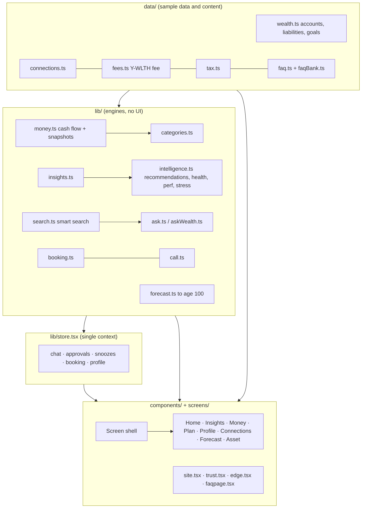
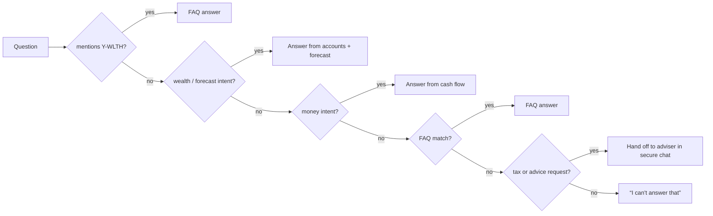
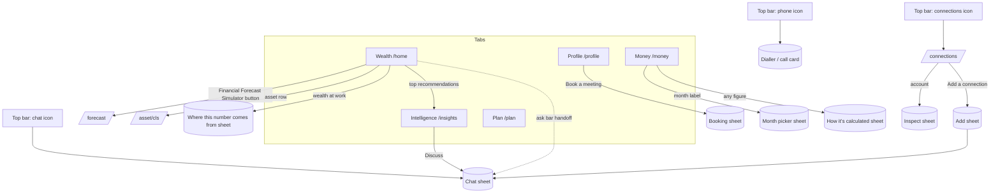

# Y-WLTH: Architecture and Screen Flow

A redesign concept for Y-WLTH's client app (iOS) and public website, built as **one Expo / React Native codebase**. This document describes how it is put together and how a person moves through it, screen by screen.

> **Status:** design concept running on illustrative sample data. Nothing here connects to real accounts, a real adviser, or a real scheduling system. Section 13 lists exactly what is mocked and what a production build would need.

---

## 1. What this is, in one paragraph

Y-WLTH is a fictional wealth adviser. The proposition is one integrated service: the app is the front door to **(1)** one view of everything a client owns and owes, **(2)** independent analysis of performance, risk and cost, **(3)** advice (including tax planning) delivered in encrypted chat, and **(4)** a financial life strategy to age 100, with recommendations the client approves. The app is **for Y-WLTH clients only**; the website explains the offer and how to become a client. This codebase designs both surfaces.

---

## 2. Stack

| Layer | Choice |
|---|---|
| Framework | Expo SDK 57, React Native 0.86, React 19 (React Compiler on) |
| Language | TypeScript (strict) |
| Routing | `expo-router` (file-based; typed routes) |
| Web | React Native Web via Metro (`web.output: "single"`) |
| Graphics | `react-native-svg` (all charts are hand-built SVG) |
| Animation | `react-native-reanimated` 4 (splash, live ticker pulse), `expo-linear-gradient` |
| Native extras | `expo-haptics`, `expo-blur` (tab bar), `expo-image`, `expo-font` |
| Font | Rubik (400/500/600/700) via `@expo-google-fonts/rubik` |
| State | One React context store (`lib/store.tsx`); everything else is derived |
| Backend | **None.** All data is in-repo sample data |

Run it:

```bash
cd Wealth-Tech
npx expo start --port 8090      # web: http://localhost:8090   iOS: exp://<LAN-IP>:8090 in Expo Go
npx tsc --noEmit                # typecheck (kept clean throughout)
```

~7,000 lines of TypeScript, no runtime dependencies beyond the above.

---

## 3. Repository layout

```
Wealth-Tech/
├─ app.json                    # name, scheme "ywlth", splash, icon, dark UI
├─ assets/images/              # splash.png (brand artwork), y-mark.png, icon, favicon, logo svg
└─ src/
   ├─ app/                     # ROUTES ONLY (expo-router). Thin files that mount a screen/page
   │  ├─ _layout.tsx           # fonts, splash gate, providers, global sheets
   │  ├─ index.tsx / index.web.tsx
   │  ├─ (app)/                # the signed-in app: tabs + hidden screens
   │  ├─ faq(.web).tsx
   ├─ screens/                 # one file per app screen (Home, Insights, Money, Plan, Profile, ...)
   ├─ components/              # shared UI + website sections
   ├─ lib/                     # ENGINES: pure logic, no UI (money, ask, search, forecast, ...)
   ├─ data/                    # SAMPLE DATA and CONTENT (wealth, fees, tax, FAQ, edge JSON)
   └─ theme/tokens.ts          # colours, fonts, radii, money formatters
```

Rule of thumb: **`app/` routes mount things; `screens/` and `components/` draw things; `lib/` decides things; `data/` holds things.**

---

## 4. Routing: one codebase, two surfaces

`expo-router` platform extensions give the app and the website different pages at the same URL:

- `index.tsx` (native) redirects into the app. `index.web.tsx` is the marketing site.
- Every `*.web.tsx` page has a tiny non-web sibling that redirects to `/home`, because expo-router requires a platform-neutral fallback. Marketing pages therefore never appear in the iOS app.
- The `(app)` route group is invisible in URLs, so the app lives at `/home`, `/insights`, `/money`, `/plan`, `/profile`, and also runs in a browser.

| URL | Surface | What it is |
|---|---|---|
| `/` | web | Marketing home (long scroll with anchors) |
| `/faq` | web | Searchable FAQ (`?open=<question>` or `?q=<query>` deep-links) |
| `/home` `/insights` `/money` `/plan` `/profile` | app (+browser) | The five tabs |
| `/connections` `/forecast` `/asset/[cls]` | app | Hidden screens (`href: null`), opened from icons/buttons |

The marketing site embeds the **real app screens** inside a phone frame (`Phone.tsx` + `EmbeddedCtx`), so what a visitor sees is the actual product code, not screenshots.

---

## 5. Layered architecture



Design principles that shape the code:

1. **Engines are pure and testable.** Nothing in `lib/` imports React components (only `store.tsx` uses React state).
2. **One definition, many surfaces.** Anything shown in more than one place has a single source: tax wording (`data/tax.ts`), fee (`data/fees.ts`), FAQ (`data/faq*.ts`), suggested questions (`lib/suggestions.ts`).
3. **Numbers are derived, not typed.** Net worth, growth, health score, recommendations and the forecast are all computed from `data/wealth.ts`, so changing an account changes every screen.
4. **Honesty is a feature.** Every figure says where it came from; sample rates are labelled; refusals hand off to a human.

---

## 6. Data layer (`src/data/`)

| File | Contains | Provenance |
|---|---|---|
| `wealth.ts` | 11 accounts (property, brokers, ISA, pensions, private stake, cash, crypto, art), 2 mortgages, 3 goals, a 366-day net-worth series, asset-class metadata | **Sample** |
| `connections.ts` | How each account connects (open banking / provider feed / exchange / valuation / entered by you), status, days to renewal, what is visible. `RENEW_DAYS = 90` | **Sample**; 90-day rule mirrors UK open banking reconfirmation |
| `fees.ts` | `YWLTH_FEE`: advice fee `pct` (currently **0.8%, sample**) charged on cash + investments + pensions | **Sample rate**; replace with the client's agreed fee |
| `tax.ts` | The tax offering as two lists: what Y-WLTH helps with / what stays with a specialist | Y-WLTH's own statements + supplied notes |
| `faq.ts` | Illustrative Q&As + the merged, ordered bank | **Illustrative** (concept copy) |
| `faqBank.ts` | 41 further Q&As with search keywords | **Ours** (`ours: true`), built from public facts |

Provenance matters: anything marked `ours` is our wording and **needs compliance review** before publication.

---

## 7. Engines (`src/lib/`)

### 7.1 Money (`money.ts`, `categories.ts`)
Ported from the NUO Money Insights logic: entries have a frequency (weekly ×52÷12, quarterly ÷3, yearly ÷12), varying income uses a 3-month average, tax payments are listed but **excluded** from every figure. Past months are **saved snapshots**; the year projection is *months gone (as saved) + this month and the rest at today's figures*. Scopes: **Total / Property / Investments**. `categories.ts` groups ~15 lines into 3–4 plain categories (Housing, Living, Education, Fees; Earned, Rent, Investment income) and writes the one-sentence insight.

### 7.2 Analysis (`insights.ts`, `intelligence.ts`)
Derives, from the accounts: blended return vs the **Y-WLTH risk-equivalent benchmark** (illustrative), attribution per holding, concentration and currency risk, stress tests, risk drivers, an all-in **cost** figure (providers + Y-WLTH fee), the **wealth health score** (diversification, costs, liquidity, currency, performance), growth per day (powering "Your wealth at work"), and the ranked list of **recommendations** (cost gaps, idle cash, benchmark gap, concentration, currency, unassigned surplus) each with a £ impact and evidence bars.

### 7.3 Forecast (`forecast.ts`)
Year-by-year simulation to age 100 from today's balances: growth by asset class, savings until retirement, retirement spending that rises with inflation, property growth and mortgage repayment. **Stress toggles:** inflation spike, tax drag, higher fees, and a market crash in the retirement year. All assumptions are listed in `ASSUMPTIONS` and shown to the user. It is an illustration, not a prediction.

### 7.4 Search (`search.ts`) and the ask pipeline (`ask.ts`, `askWealth.ts`)
One engine powers every search box. It lower-cases, treats **"Y-WLTH" / "ywlth" / "ywlth" / "Y-WLTH"** as the same word, normalises UK/US spellings, drops filler words, applies a synonym map ("charge" → fees), corrects typos against the real vocabulary, and scores **exact phrases > keywords > question words > answer words**, preferring the tightest question.

`askAnything()` routes a typed question:



The ask bar never gives personal advice: advice and tax-planning questions about **you** are handed to the adviser team with the question pre-filled in chat.

### 7.5 Booking and calling (`booking.ts`, `call.ts`)
`dial()` opens the phone dialler on touch devices and native, and shows a call card with the number on desktop. `getAvailability()` / `bookSlot()` are the **only two functions** that would be replaced by a real scheduling backend.

---

## 8. Global state (`lib/store.tsx`)

A single `AppProvider` at the root. In-memory only (resets on reload).

| State | Used by |
|---|---|
| `msgs`, `typing`, `chatOpen`, `draft`, `send`, `openChat(prefill)` | Chat sheet, ask handoffs, insight "Discuss" |
| `status` (go-ahead given) + `approve()` | Insight cards; posts a confirmation into chat |
| `snoozed` + `snooze()/unsnooze()/isSnoozed()` | Insight cards, Intelligence "Snoozed" list, Home |
| `bookingOpen`, `booked` | Booking sheet, Profile "upcoming call" |
| `profile` (age, retire age, income) | Forecast screen, Wealth ask bar |
| `unread` | Chat button badge |

Global overlays mounted once in `_layout.tsx`: **Chat sheet**, **Booking sheet**, **Call card** (web).

---

## 9. App: shell and screen-by-screen flow

### 9.1 Launch
1. Native splash shows the brand artwork (`splash.png`).
2. Fonts load; on iOS an **animated splash** plays (~3.6s): tick halo opens in 3D perspective, the real Y mark flips in with extrusion, wordmark tracks out, then everything bursts forward into the app. Skipped on web.
3. Lands on **Wealth**.

### 9.2 The shell (every screen)
- **Top bar:** small wordmark (or **Back** on detail screens) on the left; on the right **Call** (teal), **Connections** (amber dot when something needs reconfirming), **Chat** (unread badge). It sits *above* the scrolling content so it can never overlap a title. **On the web**, the wordmark (and a "Website" link on wider screens) leads back to the marketing home, so the app is never a dead end in a browser.
- **Bottom tabs (5):** Wealth · Intelligence · Money · Plan · Profile. Blurred bar on iOS.

### 9.3 Screen map



### 9.4 Wealth (`/home`): "the weight of your wealth"
Top to bottom:
1. **Net worth** counts up on open (large, always one line), with 1-year change pill.
2. **Ask bar** ("Ask about your wealth or Y-WLTH") with one-line scrolling question chips and a shuffle button. Answers appear in a card with a **×** to close.
3. **Your wealth at work:** live ticking growth for today. **Tap** → sheet explaining the number, broken down by asset class and account, reconciled to the net-worth change.
4. **Net worth chart** (scrub with finger or mouse; 1M/3M/6M/1Y).
5. **Financial Forecast Simulator** button (teaser: "at 60 you'd have £X, or £Y stress-tested") → `/forecast`.
6. **Wealth health:** score ring + five bars (diversification, costs, liquidity, currency, performance).
7. **Intelligence for you:** a banner ("£X a year you could keep") and the top two recommendation cards.
8. **How your wealth is built:** stacked area by asset class over the year; scrub to read values.
9. **Assets / Liabilities** tiles.
10. **Your month:** came-in vs went-out bars, "what you keep" and a vs-last-month chip → Money.

### 9.5 Intelligence (`/insights`): analyse and act
- **Banner:** "Found for you £X a year, £Y over ten years", count to review / approved / snoozed.
- **Tabs:** *Actions · Performance · Costs · Risk*.
  - **Actions:** recommendation cards. Each has severity, £ impact, evidence bars, and **Review recommendation** → a review screen (what Y-WLTH recommends, why, estimated impact, evidence, and what approving authorises) ending in **Approve recommendation** / **Discuss with my adviser**, **Discuss** (opens chat pre-filled), **Snooze** (picker: tomorrow / 3 days / 1 week / 2 weeks / 1 month / custom days). Snoozed items move to a **Snoozed** list with return date and **Bring back**.
  - **Performance:** your investments vs the Y-WLTH risk-equivalent benchmark (scrub chart), and attribution showing which holdings moved you away from it.
  - **Costs:** all-in £ per year, bar splitting **Y-WLTH vs providers**, a dedicated Y-WLTH fee card (sample rate, no commission), ten-year cost-drag chart, provider list.
  - **Risk:** stress tests ("property falls 10%" etc.) as £ bars, and risk broken into drivers (equities, rates, credit, inflation) plus currency exposure.

### 9.6 Money (`/money`): income and spending
- Ask bar + chips (same engine; money questions answered here).
- **Scope** Total / Property / Investments; **month navigator**: tap the label (with ▾) for the **month-and-year picker** (up to 3 years back, "Jump to this month").
- **Headline card** "FROM YOUR ACCOUNTS": income, expenses, left over, this month vs projected year. Tap any figure for the working.
- "Where these figures come from" note (actuals vs projection; tax payments excluded).
- **Where it goes / comes from:** one sentence, one stacked bar, category chips; tap a category for a short panel with its lines (Y-WLTH advice fee appears here under Fees).
- **Compare with earlier** (a year ago / last month / 6 months) and "what changed most".

*Open decision:* Y-WLTH's own description of its models ("analyse expenditure, income and returns") treats income and spending as **inputs to the plan**, not a budgeting product. The recommendation on the table is to fold this tab into **Plan** as a simpler "Income and spending" view and move to four tabs.

### 9.7 Plan (`/plan`)
Goals (mortgage-free home, education, retirement at 58) as progress rings, funded by the monthly surplus from Money, with a **what-if** control (+/− £500 a month) that moves each goal's date and on-track status.

### 9.8 Financial Forecast Simulator (`/forecast`)
Opened from Wealth. Steppers for **age** and **retire at**; four stress chips; plan vs stress-tested lines to age 100 with a retirement marker; values at 60/80/100; "investments last to 100 / run out at N"; toggle today's money vs future money; "How this works" lists every assumption. Age and retirement age are shared with the ask bar via the store.

### 9.9 Profile (`/profile`): advice, security, answers
Adviser team card (**Message / Call / Book a meeting**, upcoming call shown), **What Y-WLTH does for you**, **Tax planning** (the two lists), Security rows (Face ID, MFA, encryption, 90-day renewals), **Questions answered** (searchable FAQ with category chips; no-match hands off to chat), how your wealth is held (ISA / pension / etc. explainers).

### 9.10 Connections (`/connections`)
Summary (accounts, live feeds, needing attention), a quiet explainer of the **90-day reconfirmation**, then **Needs attention / Live connections / Added or valued by estimate**. Tap an account → inspect sheet: source, what we can see, "we can't move money or place trades", renewal progress bar, **Reconfirm / Refresh / Update value**, **Ask**. **Add a connection** lists six types and hands off to chat.

### 9.11 Asset class (`/asset/[cls]`)
Value, 1-year change, share of assets; accounts with sparklines; mortgages shown under Property.

### 9.12 Overlays
- **Chat sheet:** adviser header ("Online", encrypted), thread, typing indicator, quick chips (Ask for advice / Approve with a recommendation / ...), call button. Replies are canned in this concept.
- **Booking sheet:** month calendar → time slots (UK time, 30 min, 2h notice) → phone/video + topic (+ name/email/phone on web) → confirmation + `.ics` (web).
- **Call:** native/touch dials `+44 20 7946 0000` (the OS asks to confirm); desktop shows a card with the number, copy, and "book a time".

---

## 10. Website: structure and flow

### 10.1 Global
- **Nav:** floating glass pill. *Platform · Insights · FAQ*, a **search** icon, **Log In** (to the app) and **Call Us**. Below ~900px it collapses to a menu. Anchor links on `/` scroll to sections; on other pages they route back to `/` and scroll.
- **Search (nav icon):** command-palette over the whole Q&A bank. Shows five popular questions; typing returns ranked results with snippets; **Enter** opens the best match on `/faq` with the answer expanded.
- **Footer:** placeholder contact, links (FAQ, Call us/time), concept disclaimer.

### 10.2 Home (`/`): intended reading order
1. **Hero:** "All your wealth. One clear view." + one-line statement of what Y-WLTH is; Call Us / Explore the app; live phone preview of the Wealth screen.
2. **Concept strip:** one quiet line stating this is a design concept using illustrative sample data.
3. **Getting access:** "The Y-WLTH app is for Y-WLTH clients." Five steps (Introduction → Discovery → Your Strategy → You Decide → Onboarding & App), who it's for (UK citizens/residents, £1m+ investable) and when it may not be right.
4. **What Y-WLTH does:** four numbered parts + a facts strip (who it's for, cost, how you start, tax).
5. **Tax:** two cards (what Y-WLTH helps with / still for a specialist).
6. **One app, start to finish:** Dashboard → Analyse → Plan → Advice → Act.
7. **Feature sections** (phone previews of the real screens): Net worth · Intelligence · **Ask your money** (live demo of the ask engine) · Money · Plan · Profile.
8. **How we work** principles, then a **Call us** band and footer.

### 10.3 FAQ (`/faq`)
FAQ: hero, big search, six category chips, accordion (two columns on desktop), "still have a question?" CTAs.

---

## 11. Key user flows

**A. Becoming a client (website → app)**
`Home` → *Getting access* explains the client-only model → **Call us** (dial / call card) or **Book a meeting** (calendar) → Introduction → Discovery → Financial life strategy → client decides → onboarding → app access → **Log In**.

**B. Acting on a recommendation (app).** *What "Approve" means:* Y-WLTH does the analysis and works out the recommended action; the client reviews it and approves it, which authorises Y-WLTH to carry it out. It is not approving changes to the data (that comes from connected accounts) and not placing a DIY trade. Routine recommendations are reviewed and approved in the app; larger decisions that affect the wider plan are marked **Best discussed first** and lead with **Discuss with my adviser**. This follows Y-WLTH's description (clients "understand and approve recommendations"); its internal rules for which recommendations need a conversation are not public, so that split is a design interpretation.
`Wealth` banner or `Intelligence` → read card (evidence bars) → **Review recommendation → Approve recommendation** (confirmation posted to chat; adviser follows up) / **Discuss** (chat opens pre-filled) / **Snooze** (return date; shows in Snoozed list).

**C. Asking a question (app and web)**
Type or tap a chip → answer card (with source line and a ×) → if it's advice or tax about *you*, the card offers **Ask your adviser** which opens chat with the question pre-filled.

**D. Staying connected**
Amber dot on the connections icon → `Connections` → account needing reconfirmation (renewal bar) → **Reconfirm access**.

**E. Understanding fees**
Ask "how much do I pay in fees?" or `Intelligence → Costs` → all-in total, split Y-WLTH vs providers → Y-WLTH fee card. The same fee also appears in `Money` (Fees category) and reduces the forecast.

---

## 12. Design system

- **Palette:** navy `#09103F`, teal `#01D0D2`, orange `#FA4E19`, purple `#7130A0`; dark surfaces derived from navy. **Teal = good/positive, orange = attention/negative.** Amber for "needs attention", never for errors.
- **Type:** Rubik. Big numbers are one-line and auto-shrink (`FitText` on web, `adjustsFontSizeToFit` native).
- **Patterns:** cards with hairline borders; segmented controls; sheets for detail; one **top bar** per screen; **one sentence then one visual** for any data card; no long lists on first view (tap to expand).
- **Web-specific:** `HScroll` gives sideways rows arrow buttons, edge fades and click-and-drag; charts scrub with the mouse; focus rings suppressed on inputs (custom styling).
- **Copy rules:** Title Case for menus, buttons and headings on the website; plain English; no announcing labels ("If you only have a minute…").

---

## 13. What is mocked, and what production needs

| Concept | In this build | Production needs |
|---|---|---|
| Accounts and balances | `data/wealth.ts` | Aggregation layer (open banking AISP feeds, custodian/provider APIs), valuations for property and private assets |
| Connection status and renewals | `data/connections.ts` | Real consent records and a reconfirmation flow |
| Y-WLTH fee | Sample 0.8% in `data/fees.ts` | The client's agreed fee schedule |
| Adviser chat | Canned replies in `store.tsx` | Encrypted messaging service, adviser console, audit trail |
| Recommendations / go-ahead | Computed locally; the go-ahead is UI-only | Adviser workflow, suitability records, execution via custodians, e-sign |
| Booking | `getAvailability` / `bookSlot` mocks | Calendar free/busy (Microsoft 365 / Google) or Calendly/Cal.com; confirmation emails |
| Auth | "Log In" opens the demo app | Client identity, MFA, biometrics, session handling (Face ID/MFA claims are from Y-WLTH's FAQ) |
| Persistence | In-memory | Server state; snoozes, approvals, chat history, profile |
| Benchmark and risk drivers | Illustrative formulas | Y-WLTH's real risk-equivalent benchmark and risk model |
| Forecast assumptions | Illustrative (see `lib/forecast.ts`) | Y-WLTH's planning engine |
| Push / email reminders | None | For snoozes, renewals and bookings |

---

## 14. Compliance and content flags

- Wording marked `ours: true` in the FAQ and all access/tax copy **is illustrative and must be reviewed by a compliance specialist before any real-world use.**
- **Tax:** the site says only what Y-WLTH says: tax *planning* is part of its advice (allowances, structures, tax efficiency, plans stress-tested for tax) and it may not suit complex non-UK tax. The list of things that remain with a specialist is based on supplied notes, not a Y-WLTH statement.
- The app's "advice" is routed to humans; the ask bar and charts are explicitly illustrations.
- Unconfirmed: that the app is findable in the app stores (taken from a supplied note about the Google Play listing).
- Two quiz type names differ between the quiz ("Restless Maximiser") and the appendix ("Relentless Maximisers"); each is kept as written.

---

## 15. Known limits and open decisions

1. **Money tab vs Plan:** fold into Plan as "Income and spending" (4 tabs)? Recommended.
2. **Fee rate:** 0.8% is a placeholder; real rate needed.
3. **Real assets:** official vector logo (current Y is traced/cut from a screenshot), final splash art, app icon.
5. State resets on reload (by design for the concept).
6. Browser-tested at desktop and phone widths and on the iPhone simulator for the main flows; not tested on Android or physical devices, and automated tests are not committed to the repo.
