# Y-WLTH

A design concept for **Y-WLTH**, a fictional wealth adviser: a **concept** iOS app and website, built as one Expo / React Native codebase. It is a design exploration of how an adviser-led, data-driven wealth service can make the weight of someone's wealth felt the moment they open the app.

> **Concept only.** Y-WLTH is a fictional brand. It is not a real firm, is not authorised or regulated, and uses illustrative sample data. Nothing here is financial or tax advice.

## Live preview

| | |
|---|---|
| **Website and app** | https://y-wlth.vercel.app |
| **How to log in** | The site is password protected. When your browser asks, enter **any username** and the password. |
| **Password** | Email **oliviaxtech@outlook.com** and I'll send it over. |

The app also runs in the browser at `/home` once you are in (it is the same code as the iOS app).

## Tech stack

One TypeScript codebase produces the iOS app and the website.

| Layer | Technology |
|---|---|
| **Language** | TypeScript 6, strict mode |
| **Framework** | Expo SDK 57 with React Native 0.86 and React 19 (React Compiler enabled) |
| **Navigation** | Expo Router (file-based routes in `src/app/`; tabs for the app, `.web.tsx` files for website pages) |
| **Web** | React Native Web, exported as a static site with `expo export -p web` |
| **Animation and gestures** | Reanimated 4, Worklets, Gesture Handler |
| **Graphics** | React Native SVG for hand-built charts (line, stacked area, rings), Expo Linear Gradient, Blur and Glass Effect |
| **Native feel** | Expo Haptics, Symbols, Image, Font (Rubik via Google Fonts), Safe Area Context, Screens |
| **State and data** | In-app store (React context) with illustrative sample data in `src/data/`. No backend or database |
| **Logic** | Plain TypeScript in `src/lib/`: forecast engine, money and spending analysis, intelligence and recommendations, plain-English question answering |
| **Hosting** | Vercel, with a password gate in an edge proxy (`deploy/proxy.ts`) |
| **Tooling** | Expo CLI, ESLint (`expo lint`), `tsc --noEmit`, Playwright for site screenshots |

## What it shows

- **One view of everything you own.** Net worth, live growth, and a stacked wealth chart across providers.
- **Independent analysis.** Performance against a benchmark, all-in costs (including the advisory fee), risk and stress tests.
- **Y-WLTH recommends, you approve.** Each recommendation shows what was noticed, what is recommended, why, and the estimated impact. You approve it or discuss it with your adviser first.
- **A forecast simulator to age 100**, stress-tested for inflation, tax drag, fees and a market crash.
- **Smart search and ask bars.** Plain-English questions about your wealth, your money, or Y-WLTH itself. They understand "Y-WLTH" and "ywlth", typos and everyday wording.
- **Chat, call and booking.** Encrypted-chat styling, one-tap call, and a meeting booking calendar.
- **A website** with an animated first-visit splash, a story-scroll of how to become a client, tax explainers, a searchable FAQ.

## Run it

You need **Node 20+** and npm. For iOS you also need the **Expo Go** app on your phone, or Xcode's iOS Simulator on a Mac.

```bash
git clone https://github.com/oliviao12345/Y-WLTH.git
cd Y-WLTH
npm install
npx expo start --port 8090
```

When it starts, the terminal shows a QR code and a menu of keys:

| To see it | Do this |
|---|---|
| **Website** (and the app in a browser) | Press **`w`**, or open http://localhost:8090 |
| **iPhone** | Install **Expo Go**, then scan the QR code with the Camera app |
| **iOS Simulator** (Mac) | Press **`i`** |
| **Open a specific app screen in Expo Go** | `exp://<your-computer-ip>:8090/--/insights` (also `/home`, `/money`, `/plan`, `/profile`) |

Tips:

- The website shows the animated splash on a visitor's **first** visit only. Add **`?nosplash`** to any URL to skip it, or open a private window to see it again.
- If Expo says port 8081 is busy, this project uses **8090** on purpose. Any free port works.
- Phone and computer must be on the same Wi-Fi for Expo Go.
- The iOS Simulator cannot place calls, so the call button shows the number instead.

Useful scripts:

```bash
npm run typecheck        # TypeScript, strict
npm run build:web        # static website build into dist/
npm run screenshots      # regenerate the README screenshots (see below)
```

## Screenshots

### The iOS app in Expo Go

| Wealth | Intelligence | Money | Profile |
|---|---|---|---|
| 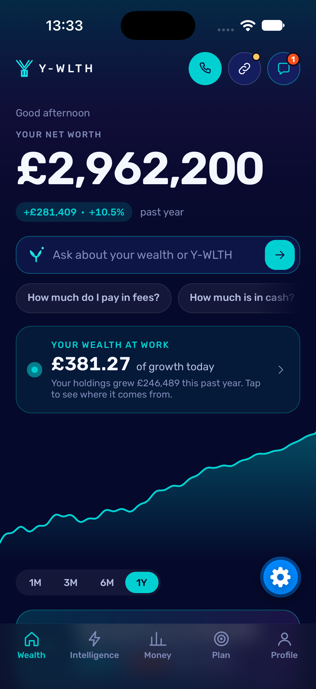 | 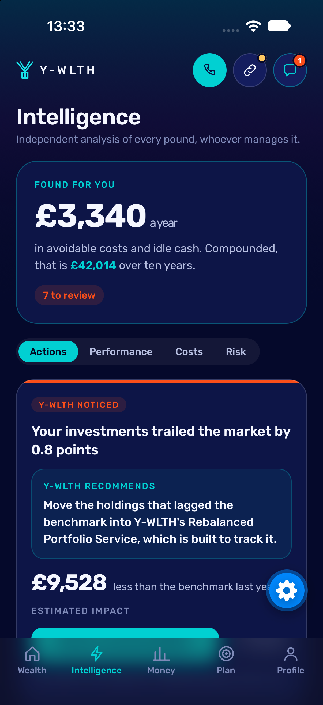 | 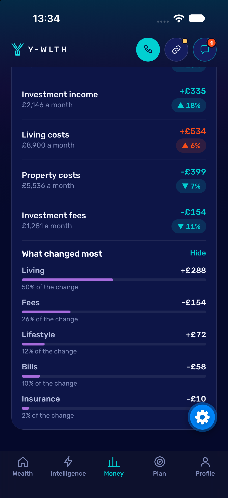 | 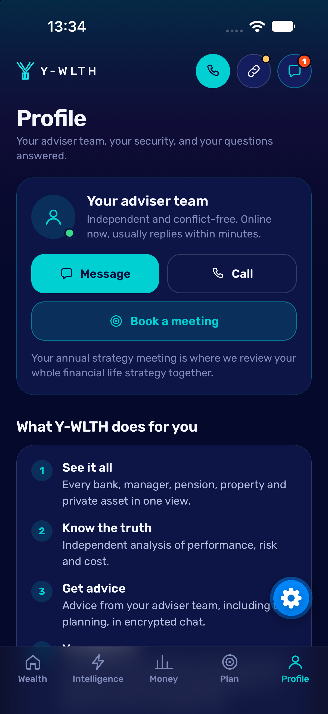 |

The blue gear is Expo Go's own developer-menu button, not part of the app.

### The app, in a browser at phone width

| Wealth | Intelligence | Money | Plan | Profile |
|---|---|---|---|---|
| 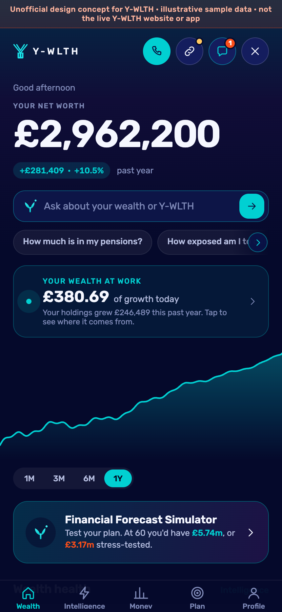 | 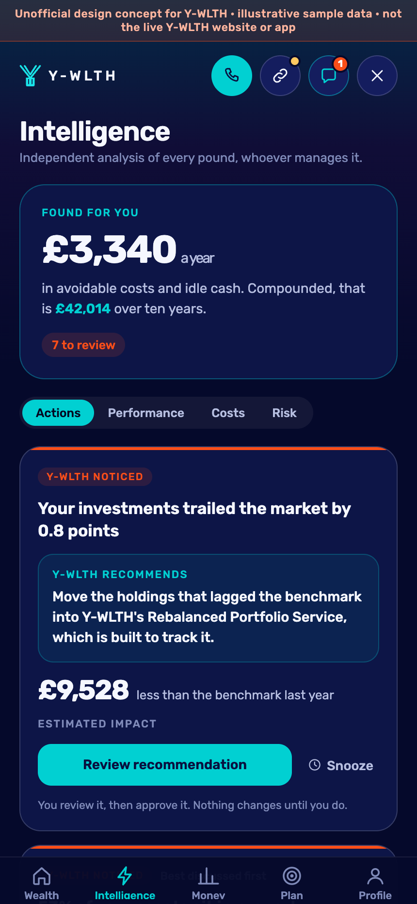 | 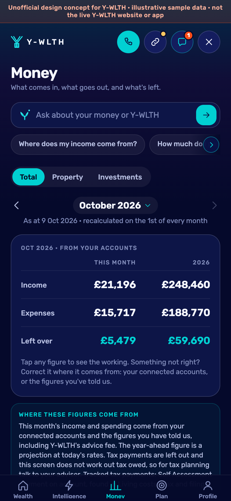 | 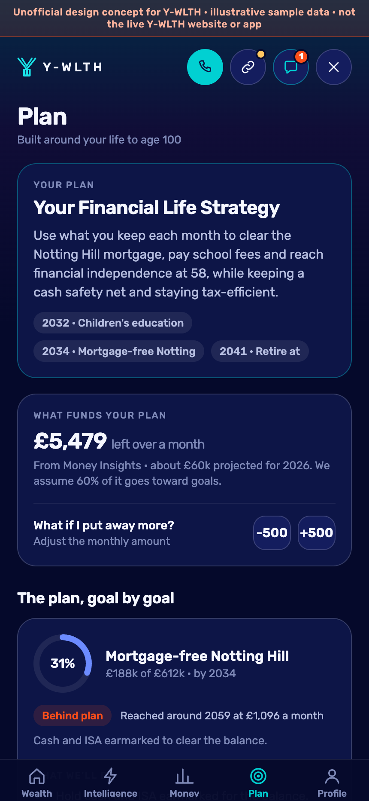 | 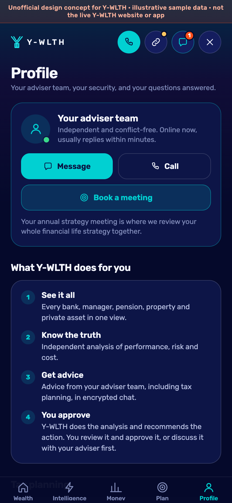 |

### The website


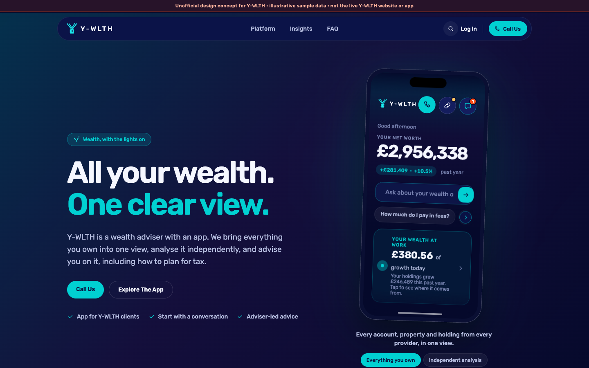
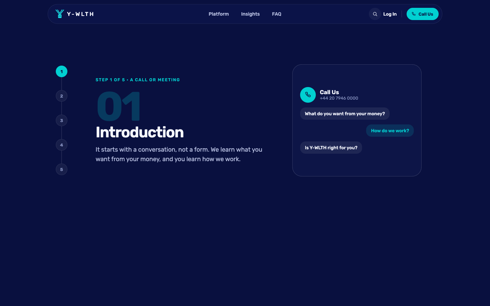
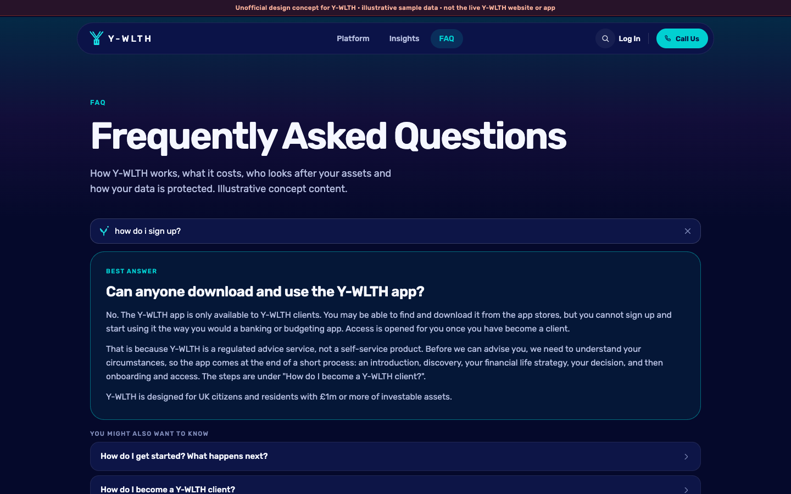

### Keeping the screenshots up to date

The images are generated from the running app, not drawn by hand. After any design change:

```bash
npx expo start --web --port 8090     # terminal 1
npm run screenshots                  # terminal 2: browser shots (needs Google Chrome; set CHROME_PATH if needed)
npm run screenshots:ios              # optional, Mac only: iOS Simulator shots (Expo Go running)
```

Then commit `docs/screenshots/`.

## Code layout

`src/app` holds routes only, `src/screens` and `src/components` draw things, `src/lib` holds the engines (money, forecast, search, ask) and `src/data` holds sample data and content. See **[ARCHITECTURE.md](ARCHITECTURE.md)** for the full screen-by-screen flow and what is mocked versus what production would need.

## Deploying (CI)

Every push to `main` runs a typecheck and a web build, and then publishes to the password-protected Vercel preview above. Pull requests run the checks only.

The workflow in `.github/workflows/ci.yml` needs three repository secrets: `VERCEL_TOKEN` (create one in your Vercel account settings), `VERCEL_ORG_ID` and `VERCEL_PROJECT_ID`. The site password itself lives in Vercel as the `SITE_PASSWORD` environment variable, and the check runs in `deploy/proxy.ts`.

## Licence and content

Code: all rights reserved by the author unless a licence is added. Figures, accounts, fees and recommendations are illustrative.
